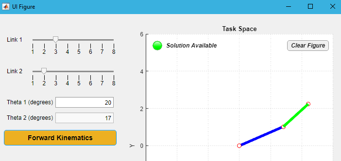
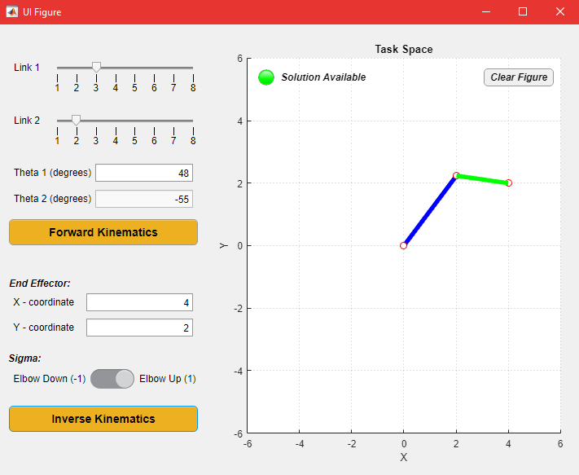

# RR-Serial-Chain-Robot-Kinematics

## Forward Kinematics

Forward Kinematics is the conversion of the inputs from the Joint Space to the Cartesian Coordinate System. This allows us to find the position of the end-effector in the task space by just giving the angles of the links that make up the system. 

The forward kinematics function was implemented in a GUI for ease of computation by developing an Application in Matlab. The link lengths can be varied using sliders and the value for theta1 can be specified by the user. The app computes theta2 based on the relation theta2 = 20.sin(3*t+pi/3) and displays the joint configuration and the end-effector location in the task space. (as t varies smoothly from 0 to 360 degrees)

## Inverse Kinematics

Inverse Kinematics is the conversion of the end-effector coordinates from the Cartesian Coordinate System to the angles of the joints in the Joint Space. This allows us to find the configuration of the links based on the position of the end-effector coordinates. 

The inverse kinematics function was also implemented in a GUI and integrated with the forward kinematics. The app computes theta1 and theta2 based on the end effector position and the sigma value can be specified by the user (dictates elbow up/down configuration). The links are then plotted in the integrated axes in the application along with displaying the corresponding theta1 and theta2 values. If there is no solution (joints are unable to reach a point in the task space), then there is a status lamp that turns red and indicates the unavailability of a feasible solution.
